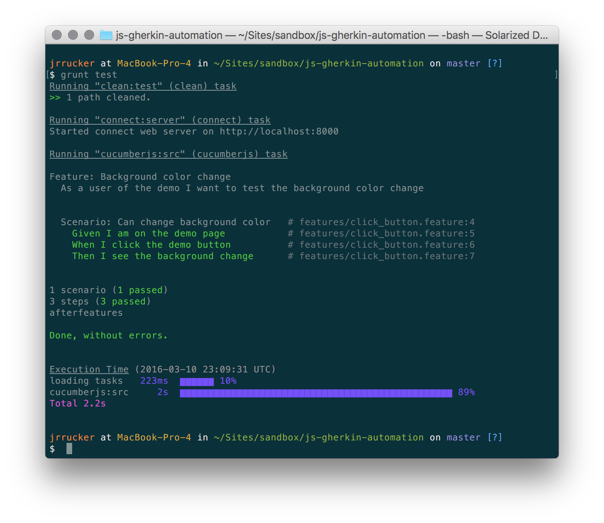

# Automation Testing with Cucumber and Selenium Web Driver in JavaScript

> Credit: Matt Baileys [repo](https://github.com/Matt-B/cucumber-js-selenium-webdriver-example) was really helpful in figuring this out.

At Interactive, we've done all of our automation testing in Java from the outset. We've thrown around the idea of doing it JavaScript for a while -- though with no traction yet. So, I wanted to play with geting a proof of concept going with Chrome's web driver.

To run this code, you'll need to have Chrome installed -- and a copy of [Chromedriver](http://chromedriver.storage.googleapis.com/index.html). Just add you're copy of Chromedriver to your `PATH`.

Then run `npm install` to install the node dependencies.

To run the test scenario, run `grunt test`. You should see Chrome popup as the test is executing and then go away.

The output in the terminal will have the test results.

You should also have a screen shot from the end of scenario in the `screenshots` directory.

